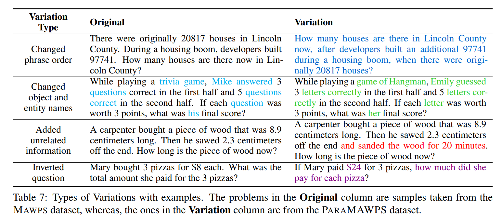
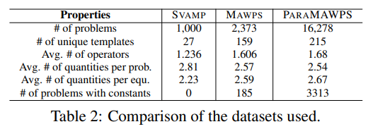
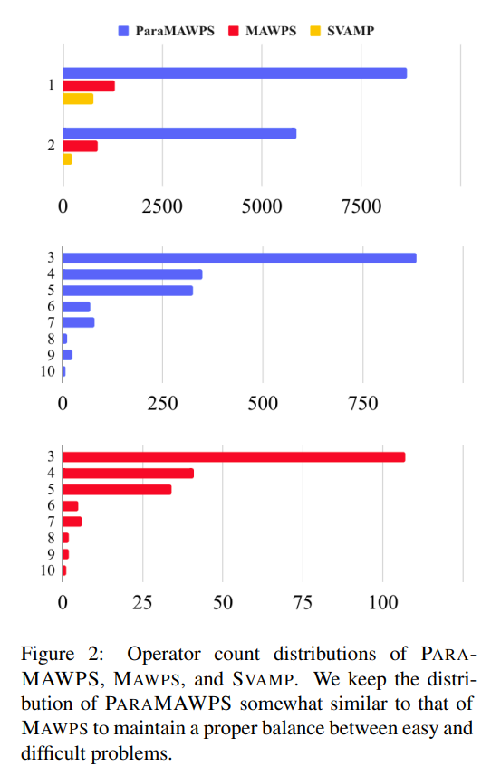
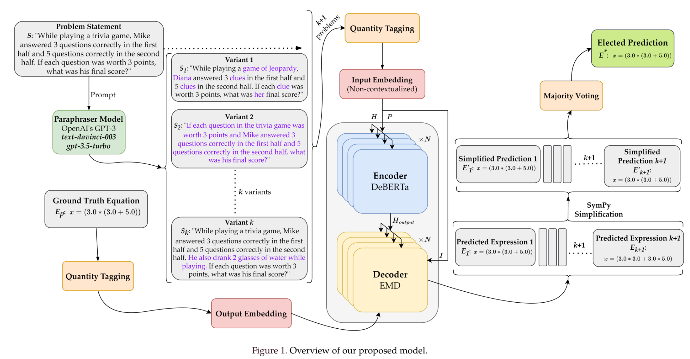
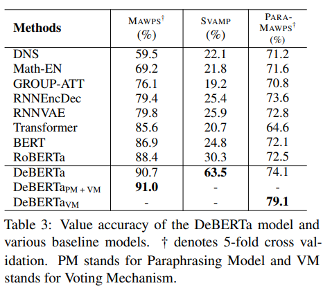
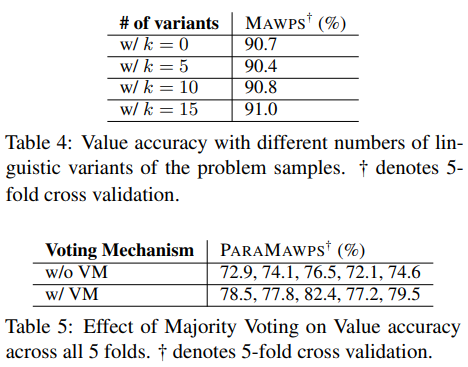

# Math Word Problem Solving by Generating Linguistic Variants of Problem Statements
This repository contains the code, data, and models of the paper titled **"Math Word Problem Solving by Generating Linguistic Variants of Problem Statements"** published in the ***Proceedings of the 61st Annual Meeting of the Association for Computational Linguistics (Volume 4: Student Research Workshop)***.

The work is outlined in a more detailed and expository manner in our Bachelor of Science (B.Sc.) thesis titled **"Variational Mathematical Reasoning: Enhancing Math Word Problem Solvers with Linguistic Variants and Disentangled Attention"** which can be accessed from the [Islamic University of Technology (IUT) Institutional Repository](http://103.82.172.44:8080/xmlui/handle/123456789/2092).

[](https://arxiv.org/abs/2306.13899)
[![anthology](https://img.shields.io/badge/ACL%20Anthology-2023.acl--srw.49-EE161F?logo=data:image/png;base64,iVBORw0KGgoAAAANSUhEUgAAAIoAAABgCAYAAADCWOqAAAAACXBIWXMAAAsTAAALEwEAmpwYAAAHSklEQVR4nO2dz28bRRTHWztOUmhS50ehad0oaCv+CSQE4uBLJISE6KESvuQP4IKAfwApKOKOEEgcLCNuqHS7B6QWJCgSgkS4sVsCWCBEwTv7muan83PRJONms+yud531vFn2Hb6y157dzLz3yZs3453ZU8U3pk+RyAbFDjY4dgAAp50igIKNBy57yZRs31A0OaEBgUChcKwqJIAQXSiixB9NxgBgBADGAeAcAOQBYFRoRMj9ftRxXvu4XSbv+p5fc1ioTxYwsV4sbbkNuJxk3l2csl4s2rJkfvgRAEBWKiidwlrYiqgQJrFAac4vPAMFzbYkyZyd23RGFVRQuoXGr4xK/e5JwAAPNecXpiSDstYGpddtj+S8OJKsgPIZIaWSvU7XheMRZRIK2r5kULJSQOlg5AEAGBTqF/R6KSvUfp/xUBAcXvK7TlT15J8AXKCIiDKBAEpGNihOo2aspaWSeePmOtONPR/t+mib6caO0LZDLaYbmy61P9twfb7lOKflKtcu23JpS7zy73m915hurIr36+I91wrTjWWmG8B0w2S60WC6sch0Y57pxh2mG18z3bjFdONLphsG040bTDeuM934gunGTXH8GdOND5huvM90Y47pxttMN15/8PEnb6YBFCcsA1b504ds8opNimYDWZAIUFZlg5JxvQ5Z5cqWzEaTtG5AWcEGJW+VK9vkPLUBNhUA5ZxVruxgG4KkdQLlEfdZryEJAuVJiijqg2rOzi1jgzJolSstbEOQtE6gPMQC5fH8iVWurJKj1IbVnJ0D2aC41W+VKyvYhiBpoUDBTGY5KGvkKLVhNWfnLOwJtxxFFHwQrISA8gjbECRNua7H/SMdB2WZHKU2rKYioFjYhiBpiQCFkaOSMY8CiKDwUU8T2xAkLdTMLDYo/5Cj1IbVRAAl4wHKA2xDkDSlJ9zaoPxJjkpEjpLFnpn9A9sQJC1M14MKCh/1/E6OUhtWEzlHaYPSwDYESQt14xI2KL+RoxIBShYblF+xDUHSwtwziw7KEjkqEaDksEH5GdsQJC1M19OPCUqfVa7cJ0epDat5uAAMDZSMAOWe5Ibz5SF71uGSzLBynu/+bs+lXQ/tCPE1THzB26ZQS7xuOD7bdBy3XGX43YD81tG1NIJSl9VgKGgbjVu3J5vV6kCzWh1qVqvDzWr1rEtDDp11vJ5xiJ/f36xWcx7qE/L7PCvkLNfnoayrXPu4/y/9Jt8fZS9NoGStcmVRIiibjXrtqaCdA8KoFwYK8zfgaDeDMcmL1FfFjhOoEUVajgIFbb1Rr13otdN7KTgEZQRhN4NBGe1TYtRz0PXUaxdlR4tugQBXfRwRJS8ZlHUVQJEZUbYa9VoBs4uJA55mCkA5rQAoE0mEpHgclBEEUAYwQDmN1PVsN+q1S2HhUBEYOARlVDIoG7KTWS9QliRHlP/kKEH/varBAjig8GQ23aAEOURFSOAQlHGE7UPRu55fJINyrOvp5JR2GRWggSNQzksG5aDrST0oKkAQEZSnCZTeR5TLnZJZVfOT4lGOMoGwxXmqIgof9UyGnUdRERg4BOVi2kDpk5zMbgdFlASBMpFGUO5LBmUqDBR+xymOKLk0gbLTqNeeDRM5VIwucJTMygalxX0VVxuSAMpuGFBUhKR4HJRLSQXlJBHlnkqg+HU3soEBn58UkEDZimNmNoztEgeKiokuHIEiO5ndBoAzcYESdJ0gUOqSQbmSFDCKPsb+P4Did60gUBaTBAo2JIADypZ46FbXdnCf53edIFDuSgRlr1GvaaoDAh0S6+b8wgWE4bHnU86iRJAw8jspiwCK7/0ocSsOUIoenyGA8vgJYL22lyqg8HmUMbGOtv0cwwHXswxzQv1dKue6jlt+z0vsc5VzXnNAiH+ebc4vXJYMSsPVrqyPvNrtbMMTItfJdRNRarIazPX3K6+tmVev7ZtXr9kJ1b758qvS1vQcgPLcC/zv7sZmt3ffWxFPa1ez6yFpatigNMNHUeejgvITesVJtmRQeHI8HgWUjFWuzJOjUgZraabVDSg/oFecZEsGhc/LjEUF5Q45KmWwlroD5TZ6xUk2AiijBAqBZ4dIZiMNjymipBGq0gxfopqPCspX6BUn2QignKOIQuDZHUBZ6waUb8mwKYtqpRm+g9Nw1JlZmnDDdlxBbVDae7jRPAq24wrJiCgECrbjCgQKvlFItkdE4bcZDEWNKN+RMVMGVGnmUVRQ+KjnR/SKk2wEUIajgvI9OSplsJZmlruZR/kGveIkGyGiECgEntYTUGhmNr1dT4ZyFGxnFJQfHuejDo9p1JPOHwXzUUGpolecZCNM4YcChR4Vl2Y4SwcRZSQqKPTc4/Su68mEB+Xz6wvW8y/ZpFhtsC8UpayXeuGXfeutd5i4uToUKD1fHZ9kFU+wQU2v63HCawb6/lRSN68hTce+70uQ3E8AI0hSCiEcjyzxgUIRZTqVEYVgUMBhRYXA6AgKdiNI08rZgIPyLw8NNdMBmSIIAAAAAElFTkSuQmCC&style=flat%22)](https://aclanthology.org/2023.acl-srw.49/)
[](https://scholar.google.com/citations?view_op=view_citation&hl=en&user=4L_7vaoAAAAJ&citation_for_view=4L_7vaoAAAAJ:d1gkVwhDpl0C)
[](https://www.researchgate.net/publication/372918265_Math_Word_Problem_Solving_by_Generating_Linguistic_Variants_of_Problem_Statements)
[](https://huggingface.co/datasets/Starscream-11813/ParaMAWPS)

[](https://paperswithcode.com/sota/math-word-problem-solving-on-paramawps?p=math-word-problem-solving-by-generating)
[](https://paperswithcode.com/sota/math-word-problem-solving-on-mawps?p=math-word-problem-solving-by-generating)
<br>
[](https://paperswithcode.com/sota/math-word-problem-solving-on-svamp?p=math-word-problem-solving-by-generating)

[](https://aclanthology.org/2023.acl-srw.49.pdf)
[](https://drive.google.com/file/d/1R-lB53BeaM-7XE0EoBZ5qfy-BSc61gup/view?usp=sharing)
[](https://aclanthology.org/2023.acl-srw.49.mp4)
[](https://drive.google.com/file/d/1FfexZxsKqL0mw2cUy7hTr4vhp7WBjhRW/view?usp=sharing)
[](http://103.82.172.44:8080/xmlui/handle/123456789/2092)

**License:** Creative Commons Attribution-NonCommercial-ShareAlike 4.0 International

[](http://creativecommons.org/licenses/by-nc-sa/4.0/)

## Dataset
In order to download our dataset **PᴀʀᴀMAWPS**, please navigate to the [ParaMAWPS](https://github.com/Starscream-11813/Variational-Mathematical-Reasoning/tree/main/ParaMAWPS) folder. We use an $`80:10:10`$ train-validation-test split for our **PᴀʀᴀMAWPS** dataset. The splits are available in `.json` format in the aforementioned folder.

### Data Format
Each row consists of a Math Word Problem (MWP). The table below describes what each column signifies.

Column Title | Description
------------ | -------------
`id` | The unique identification number of the sample. Seed problems have `id` size of $\leq 4$, whereas, variant problems have `id` size of $> 4$. The last variant of a seed problem (generally with the `id` "$`16000i`$", where $i$ is the `id` of the seed problem) is the inverse variant of the seed problem.
`original_text` | The problem statement of the MWP. The seed problems have the same problem statement as present in the Mᴀᴡᴘs dataset.
`equation` | The equation with a variable $`x`$ which solves the MWP
`quantity_tagged_text` | The problem statement of the MWP, where each quantity is replaced with a unique tag $`[Q_i]`$
`quantity_tagged_equation` | The equation with a variable $`x`$ which solves the MWP, but each quantity is replaced with its unique tag $`[Q_i]`$ in the problem statement
`have_constant` | Whether the use of a constant value is required to solve the MWP<br>For an MWP sample $`i`$ with `have_constant` label $`C_i`$, the boolean label is,<br>$`C_i =\begin{cases}FALSE, & \text{if $i$ requires $0$ constant values}\\TRUE, & \text{if $i$ requires $\geq 1$ constant values}\end{cases}`$

## Types of Variations


## Dataset Statistics



# Methodology


# Results
To reproduce the results, please refer to the documentation of [MWPToolkit](https://github.com/LYH-YF/MWPToolkit) created by **Yihuai Lan _et al_**.



## Citation
If you find this work useful, please cite our paper:
```bib
@inproceedings{raiyan-etal-2023-math,
    title = "Math Word Problem Solving by Generating Linguistic Variants of Problem Statements",
    author = "Raiyan, Syed Rifat  and
      Faiyaz, Md Nafis  and
      Kabir, Shah Md. Jawad  and
      Kabir, Mohsinul  and
      Mahmud, Hasan  and
      Hasan, Md Kamrul",
    booktitle = "Proceedings of the 61st Annual Meeting of the Association for Computational Linguistics (Volume 4: Student Research Workshop)",
    month = jul,
    year = "2023",
    address = "Toronto, Canada",
    publisher = "Association for Computational Linguistics",
    url = "https://aclanthology.org/2023.acl-srw.49",
    doi = "10.18653/v1/2023.acl-srw.49",
    pages = "362--378",
    abstract = "The art of mathematical reasoning stands as a fundamental pillar of intellectual progress and is a central catalyst in cultivating human ingenuity. Researchers have recently published a plethora of works centered around the task of solving Math Word Problems (MWP) {---} a crucial stride towards general AI. These existing models are susceptible to dependency on shallow heuristics and spurious correlations to derive the solution expressions. In order to ameliorate this issue, in this paper, we propose a framework for MWP solvers based on the generation of linguistic variants of the problem text. The approach involves solving each of the variant problems and electing the predicted expression with the majority of the votes. We use DeBERTa (Decoding-enhanced BERT with disentangled attention) as the encoder to leverage its rich textual representations and enhanced mask decoder to construct the solution expressions. Furthermore, we introduce a challenging dataset, ParaMAWPS, consisting of paraphrased, adversarial, and inverse variants of selectively sampled MWPs from the benchmark Mawps dataset. We extensively experiment on this dataset along with other benchmark datasets using some baseline MWP solver models. We show that training on linguistic variants of problem statements and voting on candidate predictions improve the mathematical reasoning and robustness of the model. We make our code and data publicly available.",
}
```

You can also cite our thesis:
```bib
@phdthesis{raiyan2023variational,
  type={Bachelor's Thesis},
  title={Variational Mathematical Reasoning: Enhancing Math Word Problem Solvers with Linguistic Variants and Disentangled Attention},
  author={Raiyan, Syed Rifat and Faiyaz, Md Nafis and Kabir, Shah Md Jawad},
  year={2023},
  school={Department of Computer Science and Engineering (CSE), Islamic University of Technology},
  address={Board Bazar, Gazipur-1704, Dhaka, Bangladesh},
  note={Available at \url{http://103.82.172.44:8080/xmlui/handle/123456789/2092}}
}
```
